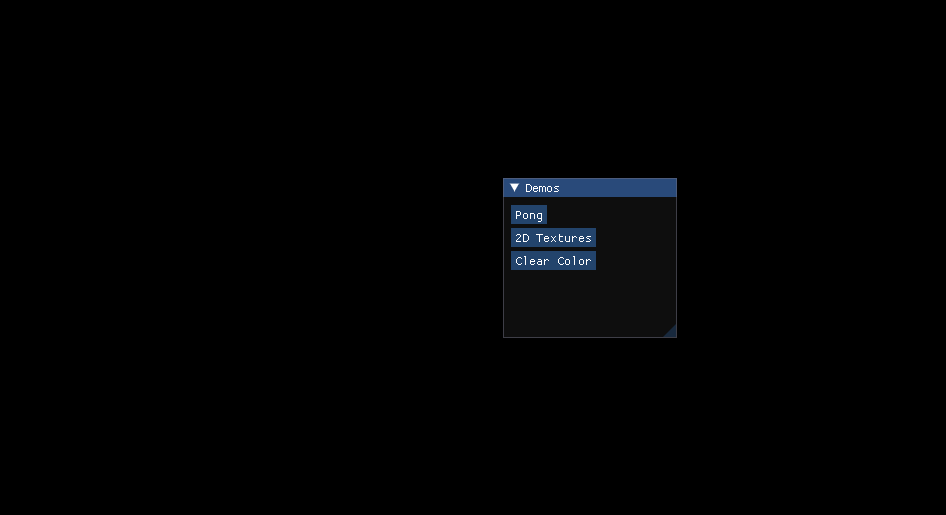
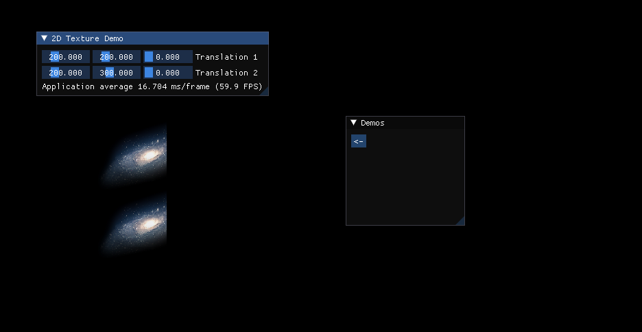
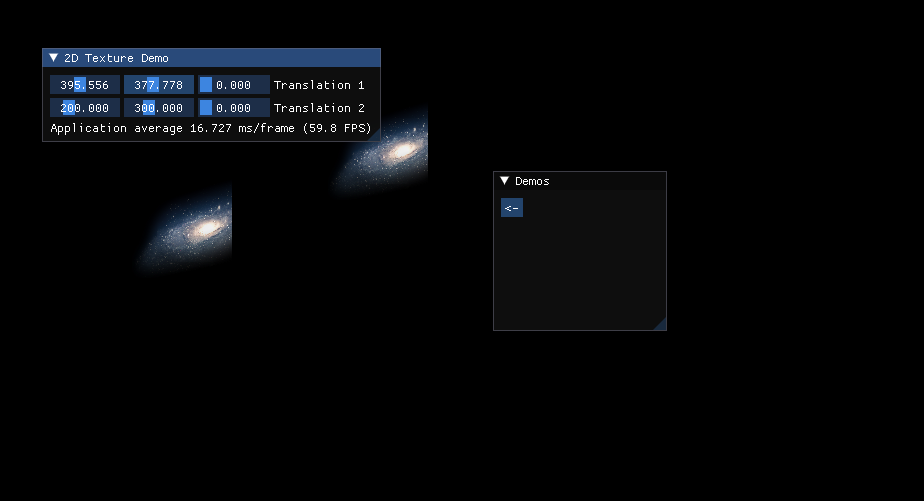

Just a repo for me to experiment with and learn OpenGL

Right now there is a Demo class which can be extended, I have 2 basic demos working right now (ClearColor and 2D textures).
I'm working on a very basic Pong clone.

Demos can be chosen using a basic ImGui menu which creates/destroys the demo objects.

